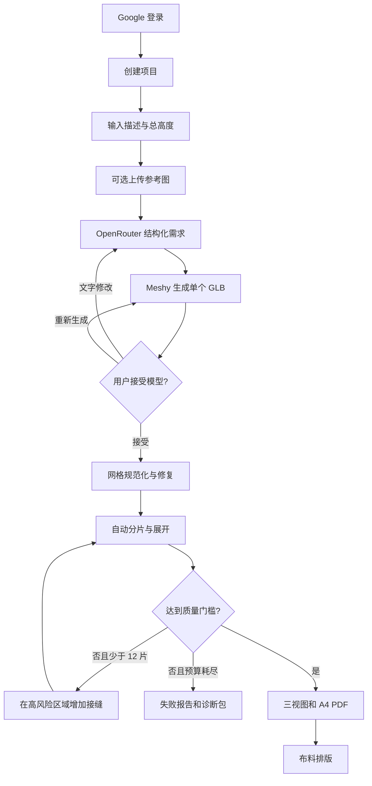
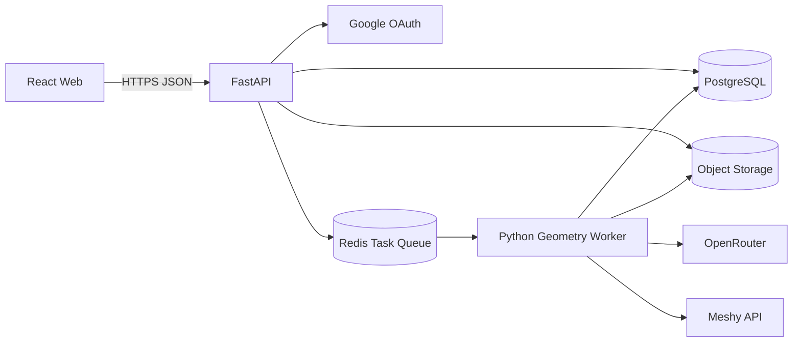

# Plush Pattern Studio POC 设计文档

## 1. 文档状态

- 状态：准备开发
- 对应路线图：[ROADMAP.md](ROADMAP.md)
- 产品阶段：真实 API 概念验证，不是生产级制版工具
- 默认语言：英文，可切换简体中文
- 默认材料：低弹短毛绒
- 默认缝份：7 mm

## 2. 产品定义

用户描述一个简化布艺玩偶并指定成品总高度。系统使用 Meshy 生成一个三维候选模型，将模型规范化为真实毫米尺寸，自动规划接缝、展开裁片并执行数字几何检查。通过门槛后，系统输出正交三视图和 1:1 A4 纸样，并允许继续进行布料排版。

### 2.1 支持的输入

- 必填：文字描述、成品总高度。
- 可选：单张参考图、草图或正侧背图片。
- 允许：圆润单体、细长耳朵、简单尾巴、少量凸起。
- 拒绝或降级：孔洞、编织结构、透明结构、独立悬浮件、复杂关节、服装层、硬表面机械结构。

### 2.2 输出

- 正、侧、背白底正交 PNG，统一比例。
- 以毫米为内部单位的纸样项目数据。
- 1:1 A4 矢量 PDF，含缝合线、裁剪线、裁片名、数量、镜像关系、页码和 5 cm 校准方格。
- 几何质量报告和诊断包。
- 可送入布料排版器的二维裁片集合。

### 2.3 非承诺

POC 不进行真实短毛绒物理仿真或实缝验收。质量报告只说明几何展开、缝边和 PDF 比例满足定义的数字门槛。所有导出必须显示“Experimental pattern / 实验性纸样”。

## 3. 核心用户流程



模型接受是不可逆计算阶段的显式确认点。每次修改都创建新版本，不覆盖已经生成的资产。

## 4. 总体架构



### 4.1 Web

职责：

- 登录、项目列表、创建项目和版本历史。
- 输入校验、参考图上传、任务进度和失败恢复。
- GLB 预览、模型接受、文字修改和重新生成。
- 2D/3D 对应预览、质量报告、PDF 下载和布料排版。

浏览器不得接收 OpenRouter、Meshy、Google Client Secret、数据库或对象存储管理密钥。

### 4.2 FastAPI

职责：

- 会话、授权和项目级访问控制。
- 创建版本、签发上传 URL、提交任务、取消和重试。
- 校验状态转换和幂等键。
- 返回经过授权的短期资产下载 URL。
- 对外部 API 预算、频率和并发进行控制。

API 不在请求线程中执行 Meshy 轮询、网格处理、渲染或 PDF 生成。

### 4.3 Worker

职责：

- 调用 OpenRouter 和 Meshy，轮询供应商任务。
- 下载和隔离外部资产。
- 执行网格诊断、修复、规范化、分片、展开和评分。
- 渲染三视图，生成 SVG/PDF 和诊断包。
- 以阶段检查点更新任务状态，支持服务重启后恢复。

POC 可先使用 Python 几何库；若特定修复或渲染无法可靠实现，再由 Worker 以无界面模式调用 Blender。该调用属于内部实现，不改变 API 契约。

### 4.4 存储

- PostgreSQL：用户、项目、版本、任务、质量指标和资产元数据。
- 对象存储：用户上传、供应商原始文件、规范化 GLB、PNG、PDF、SVG 和诊断包。
- Redis：短期任务队列、分布式锁、进度事件和速率限制。

Windows Server 可使用兼容 S3 的远程对象存储，避免将大文件存入数据库或系统盘。

## 5. 任务状态机

### 5.1 项目版本状态

```text
draft
  -> interpreting
  -> generating_model
  -> model_review
  -> normalizing_mesh
  -> segmenting
  -> flattening
  -> validating
  -> rendering
  -> pattern_review
  -> ready
```

任一执行状态可进入 `failed` 或 `cancelled`。只有 `model_review` 可进入模型修改分支；只有通过质量门槛的 `pattern_review` 可进入 `ready`。

### 5.2 状态规则

- 每个任务带客户端生成的 `idempotency_key`。
- 状态更新使用数据库比较并交换，防止两个 Worker 同时推进。
- 取消是协作式的：每个外部轮询或几何阶段开始前检查取消标记。
- 重试创建新任务，但复用已经通过校验且内容哈希相同的上游资产。
- 外部任务 ID、轮询游标和阶段检查点必须持久化。
- 用户可见进度来自离散阶段，不伪造连续百分比。

## 6. 数据模型

### 6.1 主要表

#### `users`

- `id: uuid`
- `google_subject: string unique`
- `email: string`
- `display_name: string`
- `created_at`, `last_login_at`

#### `projects`

- `id: uuid`
- `owner_id: uuid`
- `name: string`
- `locale: en | zh-CN`
- `archived_at: timestamp nullable`
- `created_at`, `updated_at`

#### `project_versions`

- `id: uuid`
- `project_id: uuid`
- `parent_version_id: uuid nullable`
- `version_number: integer`
- `status: enum`
- `prompt_text: text`
- `height_mm: decimal`
- `seam_allowance_mm: decimal default 7`
- `material_preset: low_stretch_short_plush`
- `algorithm_version: string`
- `prompt_version: string`
- `created_at`, `updated_at`

#### `jobs`

- `id: uuid`
- `version_id: uuid`
- `kind: interpret | generate_model | build_pattern | render_exports | layout`
- `state: queued | running | succeeded | failed | cancelled`
- `stage: string`
- `idempotency_key: string`
- `external_job_id: string nullable`
- `attempt: integer`
- `progress_message_key: string`
- `error_code: string nullable`
- `error_details: jsonb nullable`
- `started_at`, `finished_at`, `heartbeat_at`

唯一约束：`(version_id, kind, idempotency_key)`。

#### `assets`

- `id: uuid`
- `version_id: uuid`
- `kind: reference_image | source_glb | normalized_glb | orthographic_png | pattern_svg | pattern_pdf | diagnostic_zip`
- `storage_key: string`
- `content_type: string`
- `byte_size: bigint`
- `sha256: string`
- `metadata: jsonb`
- `created_at`

#### `pattern_runs`

- `id: uuid`
- `version_id: uuid`
- `attempt: integer`
- `piece_count: integer`
- `mean_distortion: decimal`
- `max_distortion: decimal`
- `max_seam_mismatch: decimal`
- `flipped_triangle_count: integer`
- `passed: boolean`
- `failure_reasons: jsonb`
- `metrics: jsonb`

### 6.2 几何中间格式

所有内部二维坐标使用毫米。JSON 只保存语义和低精度预览；完整网格与路径分别保存为 GLB 和 SVG。

```json
{
  "schemaVersion": 1,
  "units": "mm",
  "modelHeight": 240,
  "materialPreset": "low_stretch_short_plush",
  "pieces": [
    {
      "id": "body-front",
      "name": "Body Front",
      "quantity": 1,
      "mirrorOf": null,
      "grainDirection": [0, 1],
      "seamPathId": "piece/body-front/seam",
      "cutPathId": "piece/body-front/cut",
      "sourceFaceIdsAsset": "...",
      "seamEdges": [
        {
          "id": "body-front-left",
          "pairId": "body-back-right",
          "length3dMm": 181.42,
          "length2dMm": 181.36
        }
      ]
    }
  ],
  "quality": {
    "meanDistortion": 0.022,
    "maxDistortion": 0.087,
    "maxSeamMismatch": 0.003,
    "passed": true
  }
}
```

路径必须有稳定 ID，供 PDF、预览和排版器引用。不得从 PNG 重新追踪纸样轮廓。

## 7. API 草案

### 7.1 项目

- `POST /api/projects`
- `GET /api/projects`
- `GET /api/projects/{project_id}`
- `POST /api/projects/{project_id}/versions`
- `GET /api/projects/{project_id}/versions/{version_id}`

创建版本请求：

```json
{
  "prompt": "A round sleepy cloud plush with two long rabbit ears",
  "heightMm": 240,
  "seamAllowanceMm": 7,
  "referenceAssetIds": [],
  "locale": "en"
}
```

### 7.2 模型任务

- `POST /api/versions/{version_id}/model-jobs`
- `POST /api/versions/{version_id}/model-jobs/{job_id}/cancel`
- `POST /api/versions/{version_id}/accept-model`
- `POST /api/versions/{version_id}/revise-model`

修改请求创建子版本：

```json
{
  "instruction": "Make both ears 20 percent longer and keep the body unchanged",
  "idempotencyKey": "client-generated-uuid"
}
```

### 7.3 纸样任务

- `POST /api/versions/{version_id}/pattern-jobs`
- `POST /api/versions/{version_id}/pattern-jobs/{job_id}/retry`
- `GET /api/versions/{version_id}/pattern`
- `GET /api/versions/{version_id}/quality-report`

### 7.4 资产和进度

- `POST /api/uploads`
- `GET /api/assets/{asset_id}/download-url`
- `GET /api/jobs/{job_id}`
- `GET /api/jobs/{job_id}/events`，使用 SSE；轮询作为降级方案。

所有写接口必须校验用户对项目的所有权。资产下载 URL 应短期有效且绑定对象，不公开存储桶。

## 8. OpenRouter 职责

OpenRouter 不负责几何计算。它只执行：

1. 将自然语言和参考图整理为受支持的结构化玩偶规格。
2. 拒绝或标记超出 POC 范围的结构。
3. 为 Meshy 生成强调单体、封闭、对称和低细节的模型提示词。
4. 将用户的文字修改转换为完整的新规格，避免含糊增量指令。
5. 根据确定性的几何报告生成用户可读说明，但不得修改评分或宣称可缝。

所有 LLM 输出必须通过 JSON Schema 校验。校验失败最多自动修复一次，之后以 `PROMPT_OUTPUT_INVALID` 失败。

## 9. Meshy 适配

POC 只绑定 Meshy，但仍把调用封装在 `ModelProvider` 内，避免几何管线依赖供应商字段。

```python
class ModelProvider(Protocol):
    async def create(self, request: ModelGenerationRequest) -> ProviderJob: ...
    async def get(self, external_job_id: str) -> ProviderJob: ...
    async def cancel(self, external_job_id: str) -> None: ...
    async def download_assets(self, job: ProviderJob) -> list[DownloadedAsset]: ...
```

适配器负责：

- API 认证、超时、退避、限流和响应字段转换。
- 保存外部任务 ID、供应商状态和原始响应摘要。
- 选择 GLB 作为标准输入；纹理不参与纸样几何。
- 拒绝超过大小、面数或下载时间限制的资产。

Meshy 的 UV 不可作为纸样。UV 仅服务纹理映射，不保证真实长度、缝边配对、材料方向或缝份。

## 10. 几何处理管线

### 10.1 输入隔离

- 验证 MIME、扩展名、魔数、压缩展开大小和资源数量。
- 禁止 GLB 引用任意本地路径或非白名单远程资源。
- 在低权限 Worker 临时目录中处理，任务完成后清理。
- 为原始文件计算 SHA-256，后续阶段基于内容哈希缓存。

### 10.2 规范化

1. 合并可合并的可见壳体，删除过小孤立壳和退化面。
2. 统一法线和绕序，检测边界边、非流形边和明显自交。
3. 修复小孔；无法可靠修复的大孔直接失败。
4. 将模型主轴对齐为 $Y$ 向上、$Z$ 向前。
5. 以包围盒总高度缩放至 `height_mm`。
6. 保存不可变的规范化 GLB 和诊断指标。

### 10.3 对称与部件识别

- 在包围盒中心附近搜索候选左右对称面。
- 使用采样点镜像距离评估对称置信度。
- 低置信度时不强制改形，只将对称作为分片软约束。
- 基于细颈连接、曲率和测地距离识别耳朵、尾巴等凸起。
- 极细连接或独立悬浮壳应标记为不支持，而不是静默合并。

### 10.4 初始接缝

候选接缝成本由以下因素组合：

$$
C(e) = w_c C_{curvature} + w_s C_{symmetry} + w_v C_{visibility} + w_l C_{length} + w_b C_{branch}
$$

- 优先把接缝放在高曲率、侧面或背面。
- 鼓励左右成对的裁片边界。
- 惩罚穿过面部等主要可见区域的接缝。
- 凸起可使用独立成对裁片或加入主体侧缝。
- 初始方案从最少裁片开始，不直接追求 12 片。

### 10.5 展开

- 每个裁片必须拓扑等价于圆盘；否则先补充切口。
- 使用成熟参数化实现，例如 LSCM 或 ABF++，不得自行实现未经验证的求解器。
- 保存三角形和边界顶点的 3D 到 2D 索引映射。
- 对翻转三角形、近零面积和边界自交立即判失败。

每个三角形使用雅可比矩阵的奇异值 $\sigma_1, \sigma_2$ 估算伸缩。面积加权平均形变可定义为：

$$
D_{mean} = \frac{\sum_t A_t \max(|\sigma_1-1|, |\sigma_2-1|)}{\sum_t A_t}
$$

该定义和阈值必须带 `algorithm_version`，后续不得在不升级版本的情况下改变语义。

### 10.6 自动增加裁片

若结果不合格：

1. 聚合高形变三角形，形成风险区域。
2. 在风险区域到现有边界之间搜索低成本切线路径。
3. 添加一条接缝，并尽量添加对称对应接缝。
4. 重新展开受影响裁片，更新全局评分。
5. 只接受评分改善且没有新增翻转/自交的方案。
6. 达到 12 片、无可改善路径或计算预算耗尽时停止。

每次尝试保存 `pattern_run`，便于比较、复现和诊断。

### 10.7 缝边一致性

缝边必须来自同一条三维切割边的两个副本。检查：

$$
E_{seam} = \frac{|L_a-L_b|}{\max(L_a,L_b)}
$$

POC 门槛为 $E_{seam} \le 0.005$。二维轮廓平滑不得独立改变一侧的弧长；任何简化都必须对配对边使用共享参数化。

### 10.8 缝份

- 缝合线是展开后的原始边界。
- 裁剪线是向外偏置 `seam_allowance_mm` 的闭合路径。
- 使用支持圆角连接、自交消解和布尔运算的几何库。
- 偏置失败不得退回外接矩形。
- 小凹角风险写入质量报告。

## 11. 质量门槛

正式导出需同时满足：

| 指标 | POC 门槛 |
| --- | --- |
| 网格 | 闭合、可定向、无未修复非流形边 |
| 裁片数量 | 1-12 |
| 面积加权平均形变 | <= 3% |
| 翻转三角形 | 0 |
| 二维边界自交 | 0 |
| 最大缝边相对长度差 | <= 0.5% |
| 未配对内部接缝 | 0 |
| PDF 校准方格误差 | <= 0.2 mm |

最大局部形变只做风险提示，不使用一个孤立顶点直接阻止导出；但必须显示其数值和位置。阈值不能由 LLM 决定。

## 12. 三视图和 PDF

### 12.1 三视图

- 使用规范化模型和正交相机。
- 正面、右侧、背面分别输出同尺寸 PNG。
- 白色背景、中性材质、固定光照，不使用透视或景深。
- 三张图使用相同相机比例和模型垂直位置。
- 文件元数据记录算法版本、模型高度和视角。

### 12.2 PDF

- PDF 页面：A4，210 x 297 mm。
- 内部坐标：毫米，生成器统一转换到 PDF point。
- 默认安全边距：10 mm，可打印区域不得依赖无边距打印。
- 拼页保持全局纸样坐标；页面只是全局画布的裁剪窗口。
- 每页包含页码、行列号、项目名、版本和 100% 打印提示。
- 至少一页包含精确 50 x 50 mm 校准方格。
- 缝合线和裁剪线使用不同线型，不能只依赖颜色区分。
- 跨页裁片保留拼接参考线，但 POC 不生成对位刀口。
- PDF 与 SVG 必须来自同一二维路径数据。

## 13. 布料排版

排版器输入是带缝份的真实裁剪路径：

- 布料宽度、可用长度和单位。
- 每片数量、镜像和毛向。
- 允许旋转规则；固定毛向时只能使用保持方向的旋转集合。
- 路径间安全距离。

碰撞检测使用多边形/曲线路径的保守近似和最终精确复核。现有静态演示中的外接矩形策略只可作为初始候选生成，不能作为最终安全判断。

## 14. 前端信息架构

应用首屏是项目工作台，不制作营销落地页。

### 14.1 页面

- `/projects`：项目列表、状态、最近更新时间、新建项目。
- `/projects/new`：描述、总高度和参考图。
- `/projects/:id/model`：任务进度、GLB、三视图预览、接受/修改/重生成。
- `/projects/:id/pattern`：2D/3D 对应、质量报告、重算、PDF 下载。
- `/projects/:id/layout`：布料参数与裁片排版。
- `/settings`：账号、数据删除和语言。

### 14.2 关键状态

- 上传中、排队、供应商生成、下载、网格修复、分片、展开、验证和渲染。
- 可恢复失败和不可恢复失败。
- 超出支持范围、供应商拒绝、成本上限、超时和用户取消。
- 质量不合格时突出具体指标，不只显示“生成失败”。

## 15. 安全、隐私和成本

### 15.1 环境变量

建议变量名：

```dotenv
APP_BASE_URL=
DATABASE_URL=
REDIS_URL=
OBJECT_STORAGE_ENDPOINT=
OBJECT_STORAGE_BUCKET=
OBJECT_STORAGE_ACCESS_KEY=
OBJECT_STORAGE_SECRET_KEY=
GOOGLE_CLIENT_ID=
GOOGLE_CLIENT_SECRET=
OPENROUTER_API_KEY=
MESHY_API_KEY=
SESSION_SECRET=
```

仓库只提交 `.env.example`，不提交 `.env`。日志中对 Authorization、Cookie、签名 URL 和供应商原始请求头脱敏。

### 15.2 防护

- OAuth 使用 `state`、PKCE、Secure/HttpOnly/SameSite Cookie。
- 上传执行类型、大小、像素数、压缩展开和资源引用限制。
- Worker 使用低权限账户和每任务独立临时目录。
- 所有对象键由服务端生成，不使用用户文件名作为路径。
- 每用户限制并发生成数、每日生成数和最大存储量。
- 外部请求设置连接、响应和总任务超时，并使用带抖动的指数退避。

### 15.3 成本控制

- 每个版本只自动创建一个 Meshy 候选。
- 重生成必须由用户显式触发。
- 任务提交前记录预计成本区间。
- 超过单任务预算时停止自动重试。
- 相同输入哈希、规格版本和供应商参数可复用未过期结果。

## 16. Windows Server 部署

推荐进程：

- 反向代理：IIS 或 Caddy，负责 HTTPS 和静态资源。
- FastAPI：使用适用于 Windows 的 ASGI 进程启动，注册为 Windows 服务。
- Worker：独立 Python 进程，注册为 Windows 服务，不与 API 共进程。
- PostgreSQL 和 Redis：优先使用受支持的独立服务或远程托管实例。
- 对象存储：优先远程 S3 兼容服务。

部署要求：

- Web、API、Worker 使用不同系统账户和目录权限。
- 服务工作目录固定，不依赖交互式终端当前目录。
- 临时几何目录设置配额并定时清理。
- 日志使用 JSON、按大小/日期轮转，并带 `request_id`、`job_id`、`version_id`。
- 每日备份数据库；对象存储启用版本或生命周期策略。
- 健康检查区分 API 存活、数据库可用、队列可用和 Worker 心跳。

## 17. 错误码

首批稳定错误码：

- `INPUT_UNSUPPORTED_SHAPE`
- `PROMPT_OUTPUT_INVALID`
- `PROVIDER_RATE_LIMITED`
- `PROVIDER_GENERATION_FAILED`
- `PROVIDER_ASSET_INVALID`
- `MESH_NOT_CLOSED`
- `MESH_NON_MANIFOLD`
- `MESH_REPAIR_FAILED`
- `SEGMENTATION_NO_VALID_CUT`
- `FLATTENING_FLIPPED_TRIANGLES`
- `FLATTENING_DISTORTION_TOO_HIGH`
- `SEAM_LENGTH_MISMATCH`
- `SEAM_ALLOWANCE_OFFSET_FAILED`
- `PDF_VALIDATION_FAILED`
- `JOB_BUDGET_EXCEEDED`
- `JOB_CANCELLED`

错误详情包含机器可读字段和本地化消息键，不把 Python 堆栈直接返回浏览器。

## 18. 测试策略

### 18.1 单元测试

- 状态转换、幂等键和访问控制。
- 单位换算、模型缩放和坐标轴规范化。
- 缝边长度、形变聚合和门槛判断。
- 缝份偏置、分页坐标和 PDF point 转换。
- Prompt JSON Schema 校验。

### 18.2 几何金样测试

为每个固定 GLB 保存：

- 输入哈希和算法版本。
- 预期网格诊断范围。
- 裁片数量上限。
- 平均形变和缝边误差上限。
- SVG 路径及 PDF 页面结构快照。

几何浮点结果使用容差断言，不比较完整二进制文件是否逐字节相同。

### 18.3 集成测试

- 使用录制或桩响应测试 OpenRouter/Meshy 适配器。
- 真实供应商冒烟测试必须显式开启，避免 CI 意外计费。
- 测试 Worker 重启、重复消息、取消、超时和部分资产已生成的恢复。

### 18.4 端到端测试

- Google 登录测试环境。
- 纯文字创建项目到下载 PDF。
- 参考图、文字修改、重新生成和不合格诊断包。
- A4 PDF 解析后检查 MediaBox、校准方格和路径数量。
- 省布排版最终无重叠、无越界且遵守毛向。

## 19. 开发决策

### 已确定

- Meshy 单供应商，OpenRouter 只做结构化和提示词转换。
- 后端读取 `.env` 密钥。
- 单候选、Google 登录、云端项目。
- A4、7 mm 缝份、英文优先、中文切换。
- 标准门槛：最多 12 片，平均形变 3%，缝边误差 0.5%。
- 不输出刀口、返口和缝制顺序。

### 开发前需要用技术 Spike 确定

- 采用的网格修复、参数化和路径偏置库。
- Meshy 输出的典型面数、壳体结构和封闭率。
- 仅 Python 是否足够，哪些阶段必须调用 Blender。
- Windows 上任务队列的具体实现与运行稳定性。
- Google OAuth 回调域名和生产 HTTPS 终止方式。

这些是实现选择，不应改变本文件定义的产品状态机、几何中间格式或质量门槛。