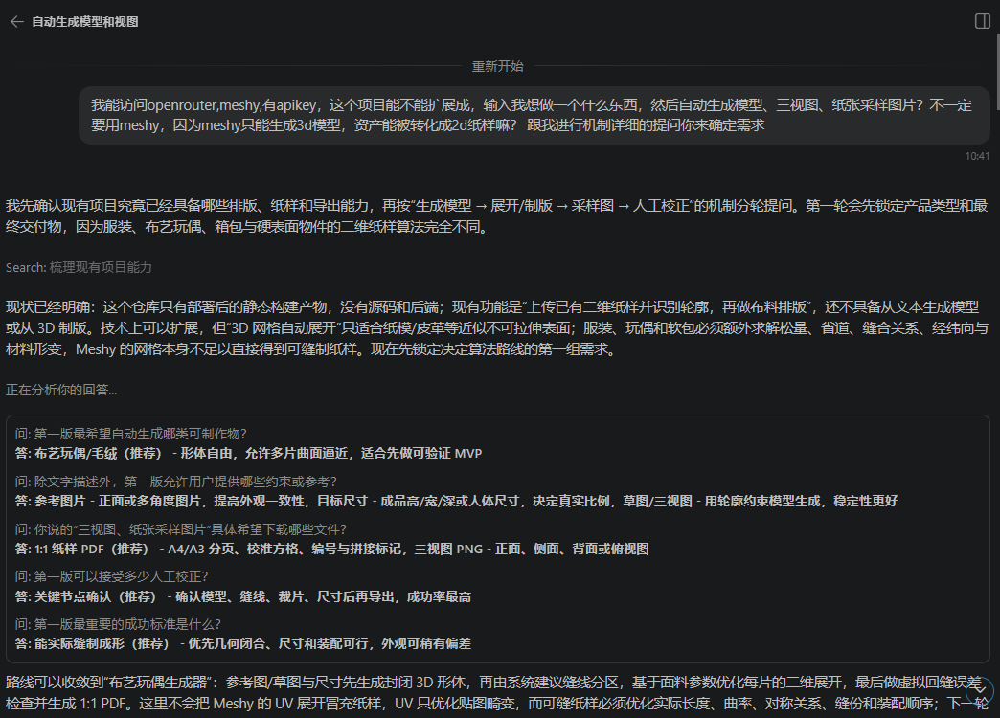
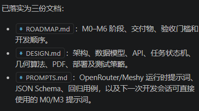

# includes

## A real problem
> **For Professionals: The Cost of Complexity**
>
> - **Inefficient Layouts:** Manual arrangement is a time-consuming "geometric puzzle" prone to human error and fatigue.
> - **High Fabric Waste:** Poor nesting results in 15%–30% of expensive material being discarded as scraps.
> - **Alignment Failure:** Manual pattern-matching (stripes/checks) is technically difficult; a tiny error can ruin the entire garment.

> **For Beginners: The Barrier to Entry**
>
> - **The "Skill Wall":** A lack of technical drawing and pattern-making knowledge stops creative ideas from becoming reality. Without knowing specialized sewing rules (e.g., darts, seam allowances, notches), raw creativity gets stuck on paper.
> - **Complexity Paralysis:** Daunting math, tool selection, and dense tutorials overwhelm novices before they even start.
> - **Low Success Rate:** High initial frustration prevents beginners from experiencing the joy and accomplishment of handmade creation.

## A working prototype
    前后端分离展示
    api doc
## How you build it

    first version: vibe coding react项目 with codex.

    1st-2nd ver workflow: 先确定需求（对话问答），落实为文档，然后vibe coding制作 MVP， 迭代

    second version：加入后端 
    其他使用的工具也要加上一些。
    meshy api
    openrouter api(如果用到了)
    技术栈
    其他工具和实现方式。

## What can be improved?
    纸张尺寸填入比较复杂，有预设更好
    页面冗长，用户交互体验差
    其他todo以及问题
